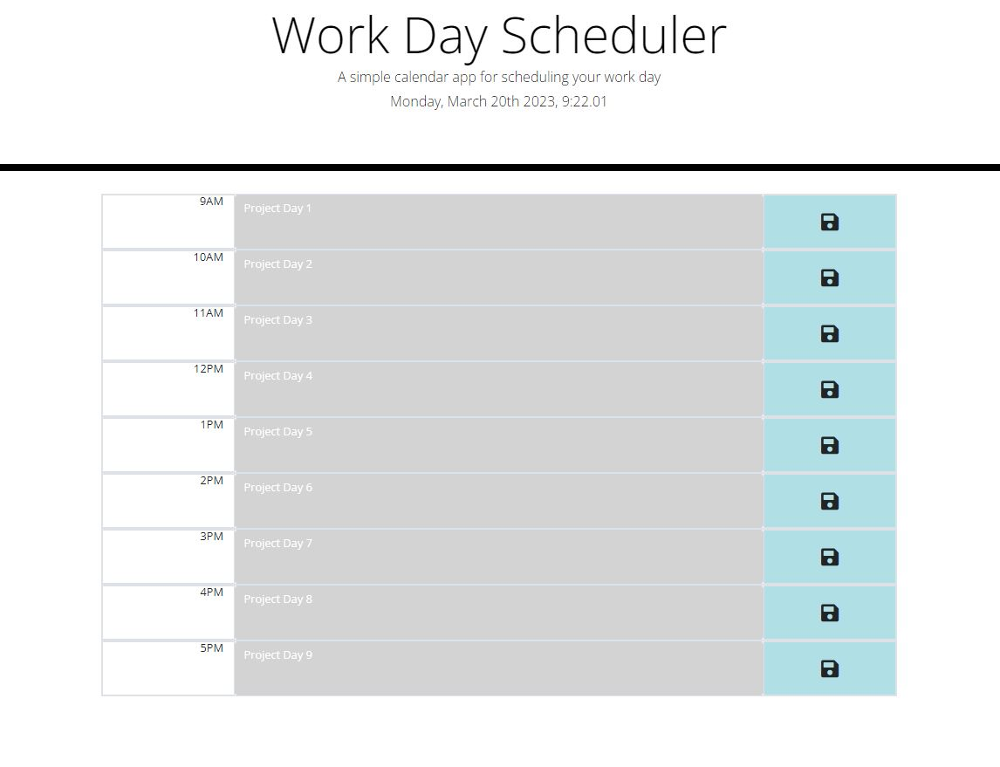

# Work-Tracker

Link to the deployed repo:

https://justinbugarin.github.io/Work-Tracker/

Description:
This application allows you to track your schedule between 9 A.M to 5 P.M.
Type down the event that the user wishes to track and click the save icon to save it to the local storage.

ScreenShots:

I couldn't get the screenshot for the full functionality of the app but the screenshot shows the events that are pass the time
